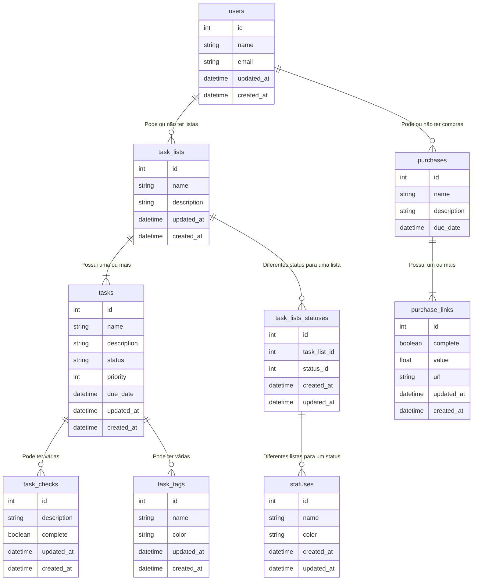
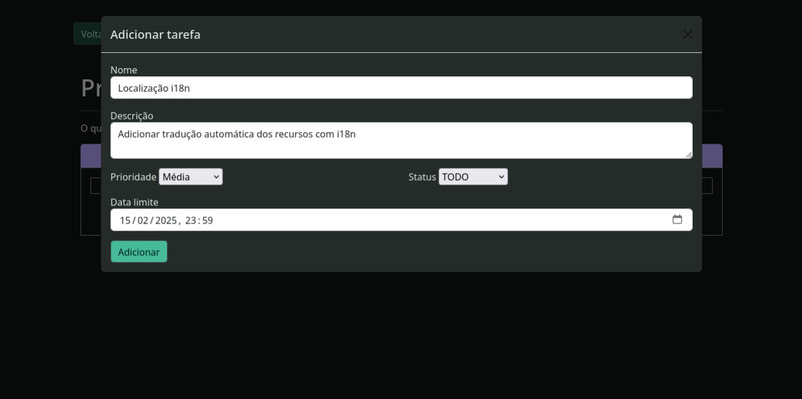
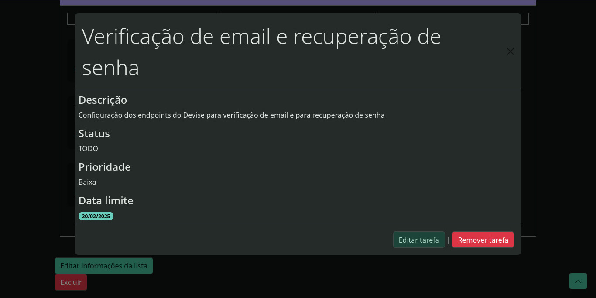
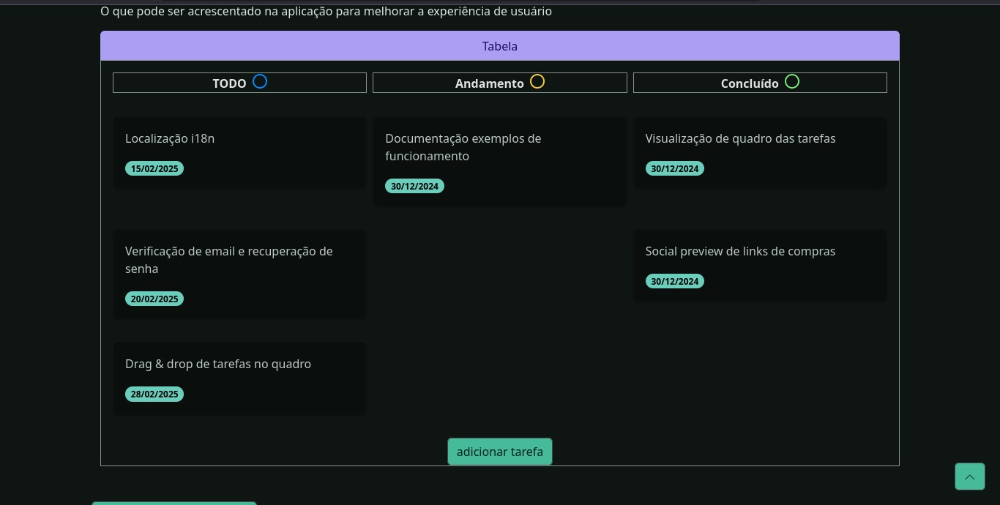
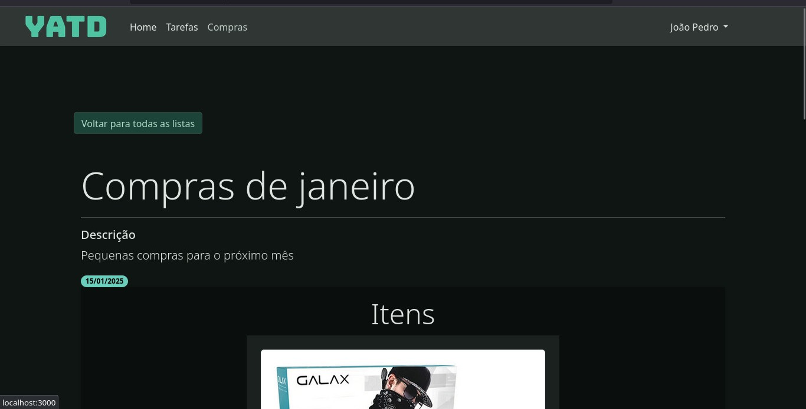
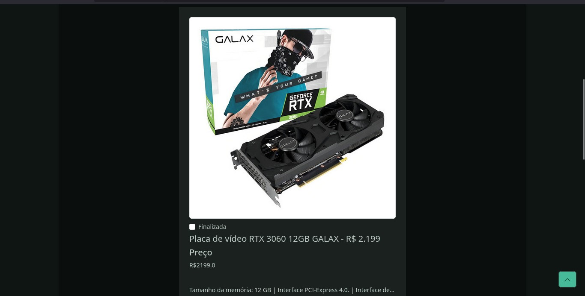

# Yet Another ToDO

Este projeto consiste de uma Todo list implementada com o framework Ruby on Rails, mas com certos
diferenciais de outras versões dessa implementação comum: além da definição de tarefas, 
você pode também agendar compras online que pretenda fazer, e visualizar os gastos feitos com
essas compras.

## Funcionalidades

- Criar diferentes listas de tarefas.
- Manipular tarefas individuais em cada lista.
- Criar compras agendadas.
- Controlar quais itens serão comprados e visualizar o balanço após as compras.

## Ferramentas

- Ruby 3.3.6
- Rails 8.0.1 (última versão)
- PostgreSQL 16.6 (última versão disponibilizada na plataforma Render)
- Redis 6.2.14 (última versão disponibilizada na plataforma Render)

## Banco de Dados

O banco de dados escolhido para essa aplicação foi o PostgreSQL pela minha familiaridade anterior,
juntamente com a facilidade de configuração e uso.

### Entidades

Abaixo está um diagrama das principais entidades da aplicação e seus relacionamentos:

## Capturas de tela

Aqui estão algumas capturas de tela da aplicação:

- **Criando tarefas**. Nessa funcionalidade eu criei os formulários e visualização de tarefas
de forma não intrusiva com o uso do Turbo Rails, que consegue realizar atualizações em partes
específicas da interface de acordo com as requisições.

- **Criando lista de compras**. Para isso inclui uma biblioteca que permite extrair as imagens e outras
informações de social preview definidas com OpenGraph, isso permitiu que os links de compra
tivessem suas informações preenchidas dinamicamente com base apenas nas informações já existentes na página.

