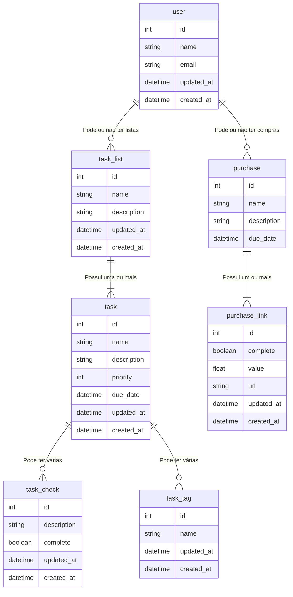

# Yet Another ToDO

Este projeto consiste de uma Todo list implementada com o framework Ruby on Rails, mas com certos
diferenciais de outras versões dessa implementação comum: além da definição de tarefas, 
você pode também agendar compras online que pretenda fazer, e visualizar os gastos feitos com
essas compras.

## Funcionalidades

- Criar diferentes listas de tarefas.
- Manipular tarefas individuais em cada lista.
- Criar compras agendadas.
- Controlar quais itens serão comprados e visualizar o balanço após as compras.

## Banco de Dados

O banco de dados escolhido para essa aplicação foi o PostgreSQL pela minha familiaridade anterior,
juntamente com a facilidade de configuração e uso.

### Entidades

Abaixo está um diagrama das principais entidades da aplicação e seus relacionamentos:

